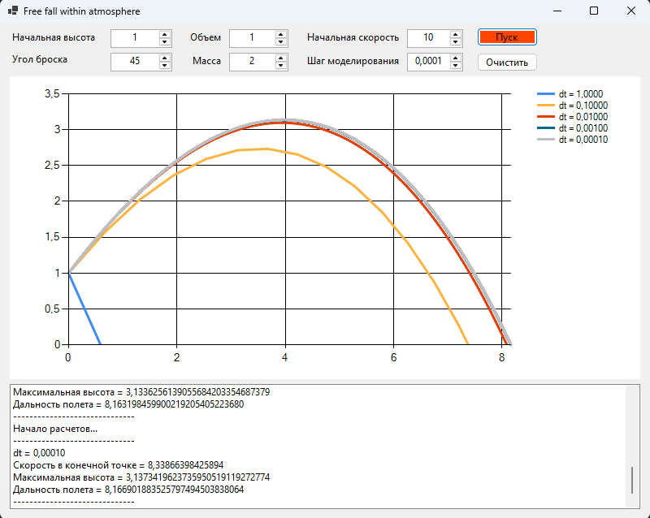

## Моделирование полёта тела в атмосфере

#### Задание:
>Реализовать приложение для моделирования полёта тела в атмосфере. Предусмотреть возможность ввода шага моделирования и вывода результатов.\
Выполнить моделирование **без очистки предыдущих результатов** для различных шагов моделирования, сравнить траектории и заполнить таблицу.

#### Обзор решения

Для решения задачи модеирования полета тела в атмосфере был выбран язык программирования C# с возможностью создания WinForms. Программа предусматривает возможность выбора таких парметров, как: начальная высота, угол броска, обьем, масса, начальная скорость, шаг моделирования (дельта времени для аппроксимации производной). По итогу выполнения расчетов для каждого значения шага модлирования программа выводит информацию о дальности полета, максимальной высоте полета и скорости в момент приземления.

На изображении ниже представлен интерфейс программы и пример вывода информации об эксперименте.

#### Наблюдаемые значения

В таблице ниже приведены результаты выполнения экспериментов с различными значениями шага модлеирования. Характеристики обьекта исследования совпадают.

| Шаг моделирования, с | 1 | 0.1 | 0.01 | 0.001 | 0.0001 |
|----------------------|---|-----|------|-------|--------|
| Дальность полёта, м |3,6504|7,6421|8,1001|8,1631|8,1669|
| Максимальная высота, м |1|2,7333|3,0965|3,1336|3,1373|
| Скорость в конечной точке, м/с |10|7,6169|8,2526|8,3336|8,3386|

#### Выводы по результатам исследования

По результатам исследования можно сделать вывод - наиважнейшей переменой моделирования является **шаг модлеирования**. При высоком шаге модлирования производная получает очень слабую аппроксимацию, что, безусловно, сказывается на результатах моделирования (см график функции для dt = 0,1 и dt = 0,01).

Оптимальным значением считается величина, уменьшение которой не дает существенных различий в результатах моделирования. Эмпирическим путем было найдено оптимальное значение для шага моделирования, равное 0,001. Уменьшение значения на порядок не привносит видимых изменений траектории полета предмета в атмосфере (см рисунок выше).

При шаге моделирования dt = 1 различия между аналитчиески и численно вычисленной производной становятся катастрофическими и следующее значение координаты *y* оказывается отрицательным, что приводит к завершению цикла моделирования.
