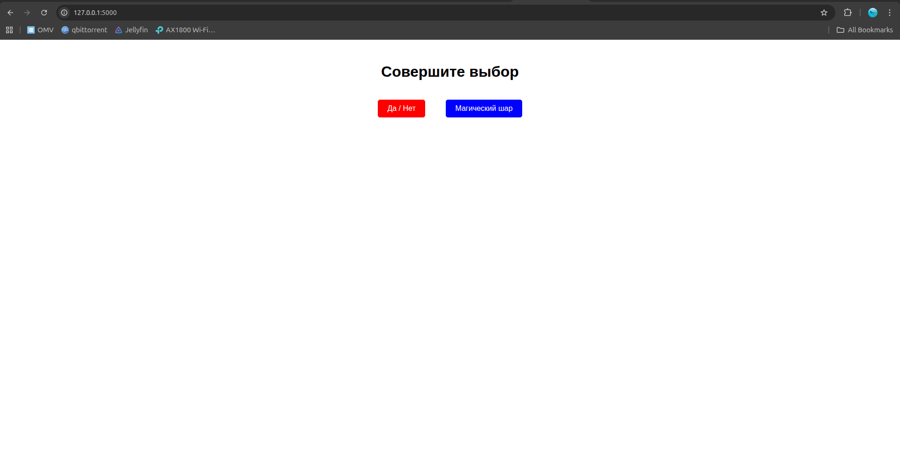
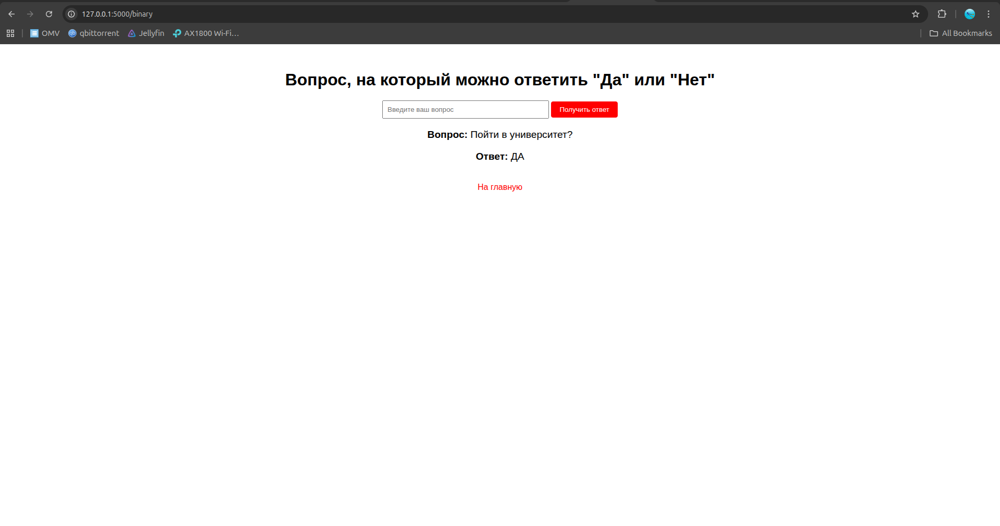
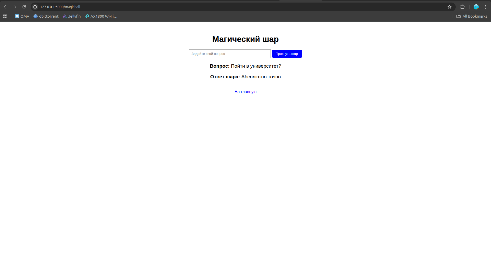

### Моделирование случайных событий (GUI)

**Часть 1:**  
Приложение «Скажи “да” или “нет”».

**Часть 2:**  
Приложение «Шар предсказаний» (Magic 8-Ball).

**Решение**

Для реализации моделирования случайных событий было разработано приложение на языке программирования python с веб-фреймворком flask. Веб интерфейс представляет из себя минималистичные странички с необходимым набором функциональных элеменотов.

1. **Приложение да / нет**

Пользователь может задать вопрос (желательно односложный) и получить на него случайный ответ. С вероятностью 0.5 пользователь получит ответ "ДА" и ответ "НЕТ", соответственно, также с вероятностью 0.5.\
В качетсве генератора случайных чисел используется *мультипликативный линейный конгруэнтный генератор*, реализованный в лабораторной работе №4

2. **Приложение «Шар предсказаний»**

Пользователь может задать вопрос и получить ответ из конечного множества заготовленных ответов:\
["Да", "Абсолютно точно", "Не могу сказать", "Нет", "Безусловно", "Ответ Нет", "Вряд ли", "Похоже, что да", "Без сомнений", "Должно быть так", "Звезды говорят: Да!", "Мало шансов", "Ответ не ясен", "Спросите позже", "Спросите снова", "Очень вероятно", "Мне кажется да", "Духи говорят Да", "Звезды против", "Потряси меня еще"]

Варианты ответа равновероятны (probability = 0.05). Выбор производится случаным образом: генерируется случайная величина (при помощи генератора из лабораторной работы 4) и далее определяется, какому варианту ответа эта величина соответствует. Определение варианта ответа производится при помощи кумулятивной суммы: вероятности вариантов ответа суммируются до тех пор, пока не превзойдут занчение случайной величины. Вариант ответа,на котором это суммирование остановилось, является результатом, выводимым пользователю.

3. **Пользовательский интерфейс**

Главная страница:

Приложение да / нет

Приложение «Шар предсказаний»

